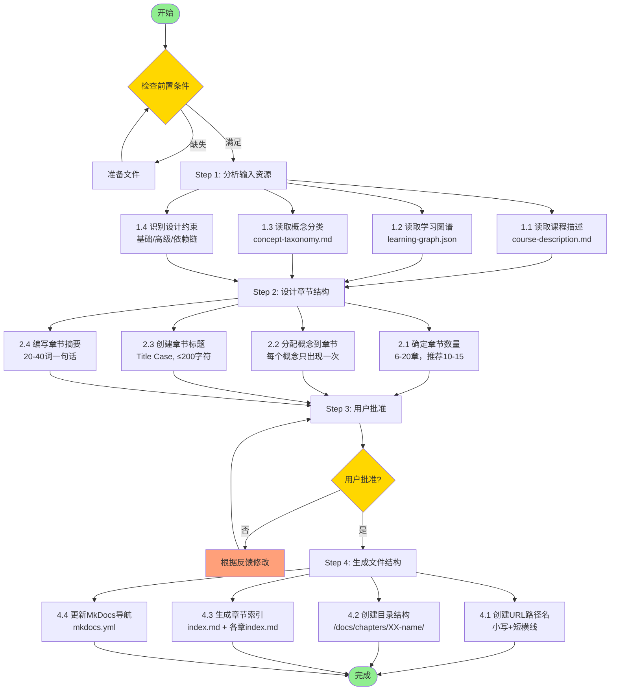

# Book Chapter Generator 使用指南

## 流程概览



---

## 前置条件检查清单

| 文件 | 路径 | 状态检查 |
|-----|------|---------|
| 课程描述 | `/docs/course-description.md` | 包含目标读者、学习目标、课程结构 |
| 学习图谱 | `/docs/learning-graph/learning-graph.json` | 约200个概念，含dependencies |
| 概念分类 | `/docs/learning-graph/concept-taxonomy.md` | 可选，有助于理解分类 |
| MkDocs配置 | `/mkdocs.yml` | 存在且可编辑 |

---

## Step 1: 分析输入资源（详细）

### 1.1 读取课程描述
提取信息：
- 课程标题和目标读者
- 学习目标和成果
- 先修知识要求
- 整体范围和目标

### 1.2 读取学习图谱
验证内容：
- 概念总数（通常 ~200）
- 依赖关系（DAG无环）
- 概念ID唯一性
- 依赖引用有效性

### 1.3 读取概念分类
理解分组：
- 分类类别和含义
- 概念如何概念性分组
- 建议的顺序或进展

### 1.4 识别设计约束
分析结构：
- **基础概念**：无依赖，应放在早期
- **高级概念**：多依赖，应放在后期
- **依赖链**：长序列的 prerequisite 关系
- **概念集群**：应在一起的相关概念组
- **孤立概念**：无依赖也无被依赖，灵活放置

---

## Step 2: 设计章节结构（详细）

### 2.1 确定章节数量

| 总概念数 | 推荐章节数 | 每章概念数 |
|---------|-----------|-----------|
| ~100 | 6-8章 | 12-17 |
| ~150 | 8-12章 | 12-19 |
| ~200 | 10-15章 | 13-20 |
| ~300 | 15-20章 | 15-20 |

**硬性限制：**
- 最少6章
- 最多20章
- 每章8-25个概念

### 2.2 分配概念到章节

**关键要求（必须满足）：**
1. ✓ 每个概念只出现在一章
2. ✓ 概念不能在其依赖之前出现
3. ✓ 章节大小平衡

**优化目标（尽量满足）：**
- 相同分类的概念尽量在一起
- 逻辑递进：基础 → 核心 → 高级
- 学习单元自然分组
- 认知负荷混合

### 2.3 创建章节标题

**格式规则：**
- Title Case（首字母大写）
- ≤200字符
- 清晰描述主题
- 标准教育术语
- 避免缩写

**好例子：**
- "Introduction to Graph Theory Fundamentals"
- "Binary Trees and Tree Traversal Algorithms"

**坏例子：**
- "Ch 1: intro"（太短，不清晰）
- "Advanced Topics In The Field Of Network Flow Optimization And Related Algorithmic Techniques"（太长）

### 2.4 编写章节摘要

**要求：**
- 单一句子
- 20-40词
- 描述覆盖内容
- 提及关键概念
- 表明学习进展角色

**示例：**
> 本章介绍AI基础概念，建立机器学习与深度学习的层级认知，为后续大模型学习奠定基础。

---

## Step 3: 用户批准流程

### 呈现格式

```
## Proposed Chapter Structure

I've designed a [number]-chapter structure for your textbook covering [total] concepts.

### Chapters:

1. **[Chapter Title]** ([X] concepts)
   [One sentence summary]

2. **[Chapter Title]** ([X] concepts)
   [One sentence summary]

...

### Design Challenges & Solutions:

- **Challenge**: [具体问题]
  **Solution**: [如何解决]

### Statistics:

- Total chapters: [X]
- Average concepts per chapter: [X.X]
- Range: [min]-[max] concepts per chapter
- All [total] concepts covered: ✓
- All dependencies respected: ✓
```

### 批准问题

```
Do you approve this chapter structure? (y/n)

If no, please specify what changes you'd like:
- Different number of chapters?
- Specific concepts moved to different chapters?
- Chapter titles revised?
- Different grouping strategy?
```

---

## Step 4: 生成文件结构（详细）

### 4.1 创建URL路径名

**转换规则：**
- 仅小写字母和短横线
- 移除所有特殊字符和标点
- 空格替换为短横线
- 必要时使用缩写（<50字符）

| 原标题 | URL路径 |
|-------|---------|
| Introduction to Graph Theory Fundamentals | `intro-to-graph-theory` |
| Binary Trees and Tree Traversal Algorithms | `binary-trees-traversal` |
| Advanced Topics in Network Flow Optimization | `advanced-network-flow` |

### 4.2 创建目录结构

```
/docs/chapters/
├── index.md                          # 章节总览
├── 01-intro-to-graph-theory/
│   └── index.md                      # 第1章索引
├── 02-binary-trees-traversal/
│   └── index.md                      # 第2章索引
├── 03-graph-representations/
│   └── index.md                      # 第3章索引
...
```

### 4.3 生成章节索引文件

**主索引** `/docs/chapters/index.md`:
```markdown
# Chapters

This textbook is organized into [X] chapters covering [Y] concepts.

## Chapter Overview

1. [Chapter 1 Title](01-url-path/index.md) - [Summary]
2. [Chapter 2 Title](02-url-path/index.md) - [Summary]
...

## How to Use This Textbook

[2-3句话说明如何按顺序学习]

---

**Note:** Each chapter includes a list of concepts covered...
```

**各章索引** `/docs/chapters/XX-name/index.md`:
```markdown
# [Chapter Title]

## Summary

[2-4句话扩展描述]

## Concepts Covered

This chapter covers the following [X] concepts:

1. [Concept Name 1]
2. [Concept Name 2]
...

## Prerequisites

This chapter builds on concepts from:
- [Chapter X: Title](../XX-name/index.md)

---

TODO: Generate Chapter Content
```

### 4.4 更新MkDocs导航

```yaml
nav:
  - Home: index.md
  - Course Description: course-description.md
  - Chapters:
    - List of Chapters: chapters/index.md
    - 1. [Chapter 1 Title]: chapters/01-url-path/index.md
    - 2. [Chapter 2 Title]: chapters/02-url-path/index.md
    ...
  - Learning Graph:
    ...
```

**注意：** 导航栏宽度有限，只显示数字，"Chapters:"标签在列表上方。

---

## 设计原则速查

### 依赖管理 ⭐关键
- DAG结构必须尊重
- 拓扑排序验证顺序
- 概念不能在依赖前出现

### 内容平衡
- 最佳：12-18概念/章
- 可接受：8-25概念/章
- 避免：<8 或 >25

### 教学流程
- 早期：基础概念，建立信心
- 中期：核心内容，复杂度递增
- 后期：高级主题，整合应用

### 认知负荷
- 早期章节不要超载
- 混合难度等级
- 相关概念分组
- 确保脚手架（前置概念在前）

---

## 常见问题解决

### 问题：某个分类概念太多（>40个）
**解决：**
- 拆分到多章
- 用子主题作为章节边界
- 与其他分类交错

### 问题：长依赖链（5+层）
**解决：**
- 分散到多章
- 早期依赖可重复
- 创建"基础"专章

### 问题：孤立概念（无依赖也无被依赖）
**解决：**
- 放在相关章末尾
- 归入"附加主题"章
- 考虑是否必要（不擅自删除）

### 问题：自然集群太大（如5个相关算法）
**解决：**
- 拆分为"Part 1"和"Part 2"
- 按复杂度分（基础 vs 高级）
- 按应用领域分

### 问题：分布不均（某章30概念，某章8概念）
**解决：**
- 拆大章
- 合并小章
- 重新调整边界
- 调整总章数

---

## 验证清单（生成后）

- [ ] 所有概念已分配（无遗漏、无重复）
- [ ] 依赖关系被尊重
- [ ] 章节大小在8-25范围内
- [ ] 标题Title Case且≤200字符
- [ ] URL路径只含小写和短横线
- [ ] 目录结构正确
- [ ] MkDocs导航已更新
- [ ] Markdown格式正确（列表前空行）
- [ ] 每章索引包含所需章节
- [ ] 用户已批准设计

---

## 下一步

章节结构生成后：
1. `mkdocs serve` 预览结构
2. 检查章节概览页面
3. 使用 chapter-content-generator 生成内容
4. 每个 index.md 中的 "TODO" 标记待填充
