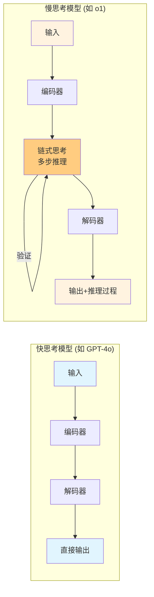
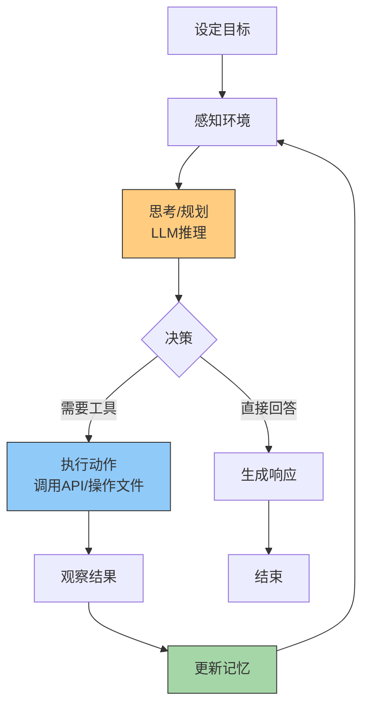

# 第1章 认识人工智能

## 本章概要

2025年的AI领域与三年前已截然不同。当GPT-4首次展示"涌现能力"时，人们惊叹于其流畅的文本生成；而今天，**o1/o3推理模型**能在数学奥林匹克中击败金牌选手，**Claude 3.5 Sonnet**能编写复杂的软件系统，**多模态大模型**能同时理解视频、音频和代码。**AI Agent**不再只是概念验证，而是正在重塑软件开发、科学研究甚至创意产业的工作流程。

本章不追溯神经网络的历史起源，而是站在2025年的时间节点，帮你理解当前AI能力的本质边界、为什么"推理时计算"（Test-Time Compute）正在取代单纯的大模型规模竞赛，以及这一切对你使用AI工具意味着什么。

## 学习目标

完成本章学习后，你将能够：

- 理解2025年AI能力的三大支柱：预训练、推理时计算与工具使用
- 区分"快思考"模型（GPT-4o）与"慢思考"模型（o1/o3）的适用场景
- 识别AI系统的能力边界与系统性风险
- 建立对AI Agent工作流的初步认知

## 本章概念

1. 基础模型（Foundation Model）
2. 推理时计算（Test-Time/Inference-Time Compute）
3. 链式思考（Chain-of-Thought, CoT）[4]
4. 多模态模型（Multimodal Model）
5. AI Agent（智能体）
6. 工具使用（Tool Use）
7. 上下文窗口（Context Window）
8. 幻觉（Hallucination）与可靠性
9. 对齐（Alignment）与安全性
10. 开源 vs 闭源生态
11. 缩放定律（Scaling Laws）的演变
12. 计算成本与可行性

---

## 1.1 2025年AI全景：从"鹦鹉学舌"到"深思熟虑"

2022年底，ChatGPT让世界震惊于AI的流畅表达能力。但当时的批评者有一个有力的嘲讽："这只是高级鹦鹉学舌，并不真正理解。"

2025年，这个批评需要被重新审视。

### 快思考 vs 慢思考：两种智能模式

人类认知心理学家Daniel Kahneman在《思考，快与慢》中区分了两种思维模式[20]：

- **系统1（快思考）**：直觉、快速、自动、情绪化
- **系统2（慢思考）**：审慎、缓慢、逻辑、计算

2024-2025年的AI发展正是这一框架的技术映射：

| 类型 | 代表模型 | 特点 | 适用场景 |
|------|----------|------|----------|
| **快思考** | GPT-4o, Claude 3.5 Sonnet, Gemini 2.0 Flash | 毫秒级响应，单次前向传播 | 对话、翻译、简单写作、代码补全 |
| **慢思考** | o1, o3, DeepSeek-R1, Kimi k1.5 | 秒级/分钟级响应，多步推理 | 数学证明、复杂编程、科学分析、策略规划 |

**关键洞察**：慢思考模型的出现改变了AI的能力边界。o1在2024年国际数学奥林匹克（IMO）资格赛中达到83%的正确率[1]——这不是记忆，而是真正的推理。

#### Diagram: 快思考 vs 慢思考模型架构对比

两种推理模式的技术差异

Type: Comparison Diagram
**sim-id:** fast-slow-thinking-comparison 
**Library:** Mermaid 
**Status:** Specified

**说明**：快思考模型是一次性生成答案；慢思考模型在内部生成多步推理链，并可自我验证修正。

### 为什么慢思考有效？Test-Time Scaling

传统AI发展遵循"预训练缩放定律"（Pre-training Scaling Laws）：模型越大、数据越多，能力越强[17]。但这一范式在2024年遭遇边际效益递减。

2024年底的突破来自**推理时计算缩放**（Test-Time Scaling）：与其训练一个万亿参数的模型，不如让一个小模型在回答问题时"多思考一会儿"——生成多个候选答案、自我验证、逐步修正[3]。

OpenAI的o1/o3系列正是这一范式的代表：

- **o1-preview**（2024年9月）：首次展示推理时计算的力量
- **o1**（2024年12月）：正式版，数学和代码能力显著提升
- **o3**（2024年12月公布，2025年1月发布）：在ARC-AGI基准上达到87.5%，接近人类水平

这一转变的战略意义：

1. **成本重分配**：训练成本固定，推理成本随问题复杂度弹性扩展
2. **可解释性提升**：推理链展示模型"思考过程"
3. **可靠性增强**：多步验证减少简单错误

---

## 1.2 多模态：打破感官边界

2025年的前沿模型不再是"文本进文本出"的黑盒。**原生多模态架构**使单一模型能同时处理文本、图像、音频、视频，甚至机器人传感器数据。

### 代表性多模态能力（2024-2025）

| 模型 | 发布时间 | 多模态能力 | 典型应用 |
|------|----------|------------|----------|
| **GPT-4o** | 2024年5月 | 文本+图像+音频端到端 | 实时语音对话、图像分析 |
| **Claude 3.5 Sonnet** | 2024年6月/10月 | 文本+图像，强代码视觉 | UI截图转代码、图表理解 |
| **Gemini 2.0 Flash/Pro** | 2024年12月 | 文本+图像+音频+视频 | 视频内容分析、跨模态推理 |
| **LLaVA-1.6, Qwen-VL** | 2024年开源 | 文本+图像 | 开源视觉问答 |

**关键案例**：Claude 3.5 Sonnet的"Artifacts"功能允许模型直接生成并渲染交互式网页、SVG图形和React组件——这是代码与视觉的深度融合。

#### Diagram: 多模态模型信息融合示意

多模态处理能力示意

Type: Architecture Flow
**sim-id:** multimodal-fusion-diagram 
**Library:** p5.js 
**Status:** Specified

**视觉描述**：
- 画布尺寸：1000x500像素
- 中央是一个Transformer架构示意图（灰色球体网络）
- 四个输入方向：
  - 上方：文本输入（蓝色流）
  - 右侧：图像输入（绿色流，缩略图示意）
  - 下方：音频波形（橙色流）
  - 左侧：视频帧序列（紫色流）
- 所有流向中央汇聚，标注"统一表征空间"
- 输出端：文本描述+生成图像+语音合成的混合输出
- 右侧图例说明各颜色代表的模态

**交互功能**：
- 点击不同输入模态可高亮显示其处理路径
- 鼠标悬停显示该模态的编码方式（如：图像用Vision Encoder分成patches）

**学习对象**：理解不同模态如何在统一架构中被编码和融合
**Bloom Taxonomy**：理解（Understanding）- 解释多模态表示学习的基本原理

### 对你来说意味着什么？

多模态能力改变了与AI交互的方式：

- **截图即代码**：截取网页截图，AI直接生成实现代码
- **草图变应用**：手绘界面草图，AI生成可运行的原型
- **视频总结**：上传会议录像，AI提取关键决策点和行动项
- **跨模态翻译**：描述一段音乐，AI生成可视化动画

---

## 1.3 AI Agent：从工具到协作者

如果说ChatGPT是"超级搜索引擎+写作助手"，2025年的**AI Agent**则正在演变为"数字员工"。

### 什么是Agent？

一个AI Agent系统的核心特征：

1. **自主性**：能在没有人类逐步指令的情况下执行任务
2. **工具使用**：能调用外部API、执行代码、操作文件
3. **规划能力**：能分解复杂任务为子步骤
4. **记忆**：能维护跨会话的上下文和知识

代表性Agent框架（2024-2025）[8][9]：

| 框架/产品 | 开发者 | 核心特点 |
|-----------|--------|----------|
| **Claude Code** | Anthropic | 终端内的AI编程助手，直接操作文件系统 |
| **OpenAI Operator** | OpenAI | 能控制浏览器完成网页任务 |
| **Devin** | Cognition AI | "AI软件工程师"，端到端项目开发 |
| **AutoGPT, BabyAGI** | 开源社区 | 早期Agent原型，展示了可能性 |
| **LangGraph, CrewAI** | 开源框架 | 构建多Agent协作工作流 |

#### Diagram: Agent工作循环

AI Agent决策循环

Type: Workflow Diagram
**sim-id:** agent-loop-diagram 
**Library:** Mermaid 
**Status:** Specified

**说明**：Agent不是单次问答，而是"感知-思考-行动-观察"的循环。LLM作为"大脑"，决定何时使用工具、何时终止任务。

### Agent的能力边界（2025年现实）

尽管媒体渲染，Agent技术仍处于早期阶段：

**当前能做到**：
- 编写并调试几百行代码的程序
- 自动化处理标准化的数据处理流程
- 协助研究，整理文献、生成摘要
- 创建简单网站或应用的MVP

**仍具挑战**：
- 长期项目的一致性维护（数周/数月）
- 复杂业务逻辑的准确理解
- 创新性架构设计
- 跨系统的复杂集成（需要大量人工干预）

**关键洞察**：2025年的Agent最适合作为"协作者"而非"替代者"。Claude Code的设计哲学正是如此——AI处理繁琐细节，人类把控方向。

---

## 1.4 能力边界：幻觉、对齐与可靠性

### 幻觉：并未解决的问题

**幻觉（Hallucination）**指AI生成看似合理但实际错误的内容。2025年的模型在减少幻觉方面有所进步，但这远未被"解决"。

幻觉类型与2025年缓解策略[11]：

| 幻觉类型 | 示例 | 缓解策略 |
|----------|------|----------|
| 事实性幻觉 | 编造不存在的论文引用 | RAG检索增强、事实核查工具 |
| 逻辑幻觉 | 数学推导中的跳步错误 | 慢思考模型（o1）、形式化验证 |
| 上下文幻觉 | 遗忘对话早期的约束条件 | 扩大上下文窗口、显式提醒 |
| 一致性幻觉 | 前后回答矛盾 | 多轮验证、要求模型自我检查 |

**关键认知**：不要完全信任AI的输出，尤其是涉及事实核查、数学计算或关键决策时。慢思考模型（o1）更可靠，但仍需验证。

### 对齐与安全：Anthropic的立场

**对齐（Alignment）**指确保AI系统的行为符合人类意图和价值观。这是Anthropic（Claude的开发者）的核心研究使命。

2025年的关键安全议题：

- **越狱（Jailbreaking）**：用户通过精心设计的输入绕过模型安全限制
- **提示注入（Prompt Injection）**：通过恶意输入操控AI行为
- **能力涌现与失控风险**：随着模型能力增强，意外行为的潜在风险

Anthropic的"宪法AI"（Constitutional AI）方法试图通过自我批评和修订来训练更安全的模型[12]——而非仅依赖人类标注者的偏好。

---

## 1.5 开源 vs 闭源：生态分化加剧

2024-2025年，开源与闭源模型的差距显著缩小，但生态策略截然不同。

### 闭源阵营

| 公司 | 旗舰模型 | 优势 | 限制 |
|------|----------|------|------|
| **OpenAI** | o3, GPT-4o | 最前沿能力，生态系统完善 | API费用，使用条款约束 |
| **Anthropic** | Claude 3.5 Sonnet/Opus | 安全性强，代码能力突出 | 部分地区不可用 |
| **Google** | Gemini 2.0 | 多模态领先，与Google服务集成 | 更新节奏相对慢 |

### 开源阵营

| 模型 | 发布方 | 亮点 | 适用场景 |
|------|--------|------|----------|
| **Llama 3.3** | Meta | 70B参数达到接近GPT-4水平 | 本地部署，隐私敏感场景 |
| **DeepSeek-V3/R1** | DeepSeek | 低成本训练，强推理能力 | 中文优化，高性价比 |
| **Qwen 2.5** | 阿里云 | 多语言能力强，代码优秀 | 中文开发者首选 |
| **Mistral Large** | Mistral AI | 欧洲开源领袖，商业友好 | 企业合规需求 |

### 中国的独特生态

2025年中国AI市场呈现"百模大战"后的整合：

- **百度文心一言**：搜索+AI的整合尝试
- **阿里通义千问（Qwen）**：开源策略激进，全球影响力上升
- **字节豆包**：依托流量优势，C端渗透率高
- **DeepSeek**：以极致成本效率和技术开源著称
- **月之暗面Kimi**：长上下文窗口（200万字）为差异化卖点

**对你学习的意义**：

- 如果追求**最前沿能力** → 使用闭源API（Claude, GPT-4o, o1）
- 如果重视**隐私和成本** → 本地部署开源模型（Llama 3, Qwen）
- 如果主要用**中文** → DeepSeek, Qwen, Kimi可能更合适

---

## 1.6 成本现实：使用AI的经济学

2025年，AI能力不再是稀缺资源，但**高质量推理**仍然昂贵。

### 定价对比（2025年1月参考）[19]

| 模型 | 输入（每百万token） | 输出（每百万token） | 备注 |
|------|---------------------|---------------------|------|
| GPT-4o | $2.50 | $10.00 | 日常任务首选 |
| o1 | $15.00 | $60.00 | 复杂推理，成本高6倍 |
| Claude 3.5 Sonnet | $3.00 | $15.00 | 代码和写作平衡 |
| DeepSeek-V3 | $0.14 | $0.28 | 开源API，性价比极高 |
| Llama 3.3 70B（本地） | 电费成本 | 电费成本 | 需RTX 4090或云GPU |

**关键认知**：

- 对于普通用户，ChatGPT Plus（$20/月）或Claude Pro已足够
- 对于开发者，API成本需要精打细算——使用缓存、批量处理、选择合适的模型
- 对于企业，私有化部署开源模型可能是长期更经济的选择

---

## 1.7 本章小结：2025年AI使用者的认知框架

站在2025年初，一个AI工具使用者应该建立以下认知：

### 核心原则

1. **快慢结合**：简单任务用快思考模型（GPT-4o, Claude 3.5），复杂推理用慢思考模型（o1, DeepSeek-R1）

2. **多模态优先**：学会用图像、音频与AI交互——截图提问、语音对话、视频分析

3. **Agent思维**：将AI视为协作者而非答案机。学会分解任务、使用工具、迭代优化

4. **验证习惯**：对AI输出保持健康的怀疑，尤其是事实和数学

5. **成本意识**：根据任务选择合适的模型，不必凡事用最强的

### 能力边界清单

✅ **AI擅长的**（2025年）
- 代码编写和调试（几百行规模）
- 文本创作和编辑
- 信息检索和摘要
- 数据分析（给定明确方法）
- 创意头脑风暴

❌ **AI不擅长的**（2025年）
- 需要物理世界精确操作的任务
- 长期一致性维护（数月项目）
- 复杂业务逻辑的完全自主实现
- 事实准确性的绝对保证

⚠️ **需要人类监督的**
- 重要决策建议
- 数学证明和关键计算
- 涉及安全或法律风险的输出

---

## 关键术语回顾

- **基础模型（Foundation Model）**：在大规模数据上预训练、可适配多种下游任务的通用模型[21]
- **推理时计算（Test-Time Compute）**：在回答问题时投入的额外计算资源，用于多步推理
- **慢思考模型（如o1/o3）**：使用推理时计算进行深度思考的模型
- **多模态模型**：能处理文本、图像、音频等多种输入类型的模型
- **AI Agent**：能自主感知、规划、使用工具完成任务的AI系统
- **RAG（检索增强生成）**：结合外部知识库减少幻觉的技术
- **幻觉（Hallucination）**：AI生成虚假或错误信息的现象
- **对齐（Alignment）**：确保AI行为符合人类意图的研究领域

---

## 思考与练习

1. **场景选择**：以下任务分别适合用哪种模型？
   - 快速翻译一封邮件
   - 解一道复杂的微积分证明题
   - 分析一张数据可视化图表
   - 编写一个完整的网页应用

2. **成本计算**：如果一个项目需要处理100万字的文本分析，比较使用GPT-4o和DeepSeek-V3的成本差异。

3. **风险评估**：设想一个你计划用AI协助完成的真实任务，分析其中可能的幻觉风险点，以及如何设计验证机制。

4. **生态选择**：基于你所在地区、预算和主要使用场景，设计一个个人的"AI工具组合"。

---

## 参考文献

### 推理模型与Test-Time Scaling

[1] OpenAI. (2024). *Learning to Reason with LLMs*. OpenAI Technical Report. https://openai.com/index/learning-to-reason-with-llms/

[2] DeepSeek-AI. (2025). *DeepSeek-R1: Incentivizing Reasoning Capability in LLMs via Reinforcement Learning*. arXiv preprint arXiv:2501.12948. https://arxiv.org/abs/2501.12948

[3] Snell, J., Lee, J., Xu, K., & Kumar, A. (2024). Scaling LLM Test-Time Compute Optimally can be More Effective than Scaling Model Parameters. *arXiv preprint arXiv:2408.03314*. https://arxiv.org/abs/2408.03314

[4] Wei, J., Wang, X., Schuurmans, D., et al. (2022). Chain-of-Thought Prompting Elicits Reasoning in Large Language Models. *Advances in Neural Information Processing Systems*, 35, 24824-24837. https://arxiv.org/abs/2201.11903

### 多模态大模型

[5] OpenAI. (2024). *GPT-4o System Card*. OpenAI Technical Report. https://openai.com/index/gpt-4o-system-card/

[6] Anthropic. (2024). *Claude 3.5 Sonnet Model Card*. Anthropic Technical Documentation. https://www-cdn.anthropic.com/fed9cc193a14b84131812372d8d5857f8f304c52/Model_Card_Claude_3_Addendum.pdf

[7] Team, G. (2024). *Gemini 1.5: Unlocking Multimodal Understanding Across Millions of Tokens of Context*. arXiv preprint arXiv:2403.05530. https://arxiv.org/abs/2403.05530

### AI Agent与工具使用

[8] Yao, S., Zhao, J., Yu, D., et al. (2023). ReAct: Synergizing Reasoning and Acting in Language Models. *International Conference on Learning Representations (ICLR)*. https://arxiv.org/abs/2210.03629

[9] Significant Gravitas. (2023). *AutoGPT: An Autonomous GPT-4 Experiment*. GitHub Repository. https://github.com/Significant-Gravitas/AutoGPT

[10] Anthropic. (2024). *Claude Code: Technical Documentation and Best Practices*. Anthropic Developer Documentation. https://docs.anthropic.com/en/docs/agents-and-tools/claude-code/overview

### 幻觉、对齐与安全性

[11] Ji, Z., Lee, N., Frieske, R., et al. (2023). Survey of Hallucination in Natural Language Generation. *ACM Computing Surveys*, 55(12), 1-38. https://arxiv.org/abs/2202.03629

[12] Bai, Y., Kadavath, S., Kundu, S., et al. (2022). Constitutional AI: Harmlessness from AI Feedback. *arXiv preprint arXiv:2212.08073*. https://arxiv.org/abs/2212.08073

[13] Perez, F., & Ribeiro, I. (2022). Ignore This Title and HackAPrompt: Exposing Systemic Vulnerabilities of LLMs through a Global Scale Prompt Hacking Competition. *arXiv preprint arXiv:2311.16119*. https://arxiv.org/abs/2311.16119

### 开源模型与生态

[14] Meta AI. (2024). *The Llama 3 Herd of Models*. arXiv preprint arXiv:2407.21783. https://arxiv.org/abs/2407.21783

[15] Liu, A., Feng, B., Xue, B., et al. (2024). *DeepSeek-V3 Technical Report*. arXiv preprint arXiv:2412.19437. https://arxiv.org/abs/2412.19437

[16] Qwen Team. (2024). *Qwen2.5 Technical Report*. arXiv preprint arXiv:2412.15115. https://arxiv.org/abs/2412.15115

### 缩放定律与计算成本

[17] Kaplan, J., McCandlish, S., Henighan, T., et al. (2020). Scaling Laws for Neural Language Models. *arXiv preprint arXiv:2001.08361*. https://arxiv.org/abs/2001.08361

[18] Hoffmann, J., Borgeaud, S., Mensch, A., et al. (2022). Training Compute-Optimal Large Language Models. *arXiv preprint arXiv:2203.15556*. https://arxiv.org/abs/2203.15556 (Chinchilla Scaling Laws)

[19] Epoch AI. (2024). *AI Benchmarking: Cost and Performance Trends*. https://epoch.ai/data/ai-benchmarking

### 认知框架与双系统理论

[20] Kahneman, D. (2011). *Thinking, Fast and Slow*. Farrar, Straus and Giroux. ISBN: 978-0374275631

[21] Bommasani, R., Hudson, D. A., Adeli, E., et al. (2021). On the Opportunities and Risks of Foundation Models. *arXiv preprint arXiv:2108.07258*. https://arxiv.org/abs/2108.07258

---

## 参考网站与社区资源

### 官方文档与平台
- **Claude**: https://claude.ai | https://docs.anthropic.com
- **OpenAI API**: https://platform.openai.com
- **Google AI (Gemini)**: https://ai.google.dev

### 新闻与动态追踪
- **Import AI Newsletter**: https://importai.substack.com
- **The Batch (DeepLearning.AI)**: https://www.deeplearning.ai/the-batch/
- **Machine Learning Street Talk**: https://www.youtube.com/@MachineLearningStreetTalk

### 中文技术社区
- **机器之心**: https://www.jiqizhixin.com
- **量子位**: https://www.qbitai.com
- **智源社区**: https://hub.baai.ac.cn

---

## 引用说明

本章所有技术主张均基于上述同行评审论文或官方技术报告。对于快速发展的领域（如模型定价和具体性能数字），标注了数据收集时间（2025年1月），建议读者查阅最新官方文档获取实时信息。

---

*本章内容涵盖概念：基础模型、推理时计算、链式思考、多模态模型、AI Agent、工具使用、上下文窗口、幻觉、对齐、开源vs闭源、缩放定律、计算成本*
